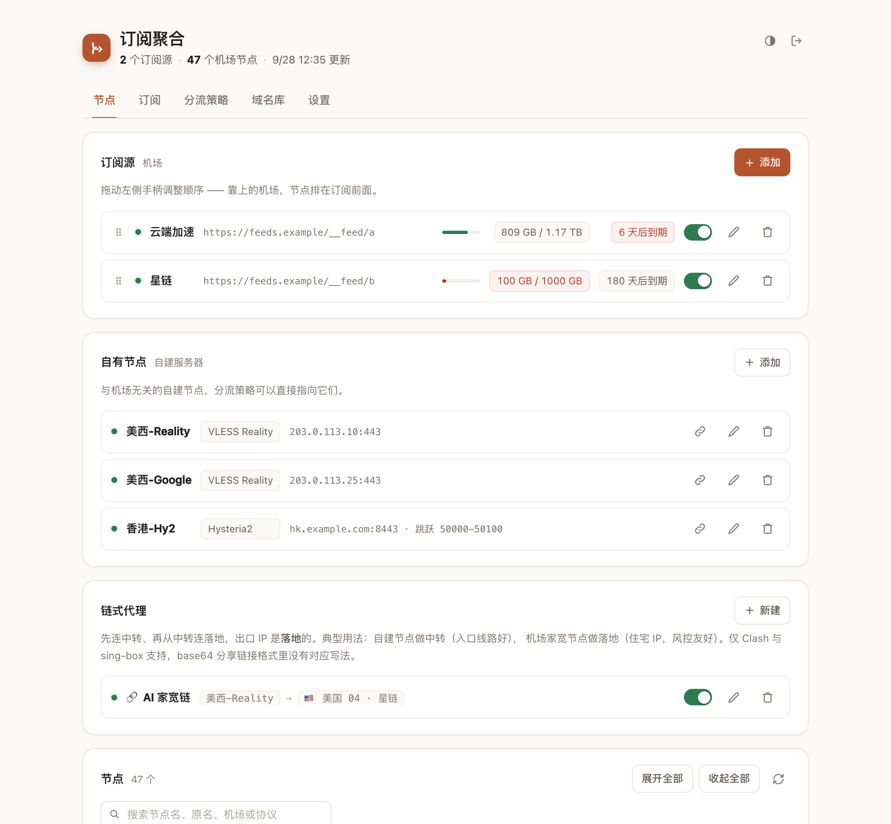
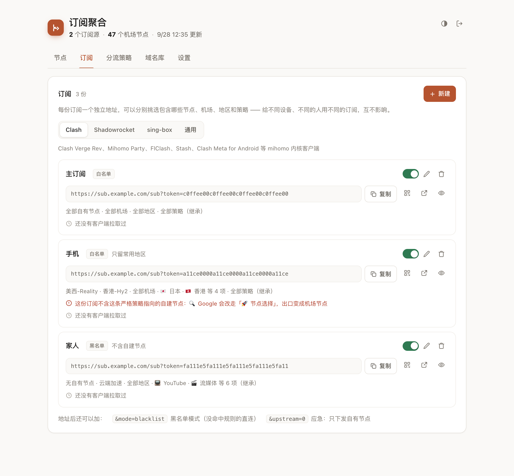
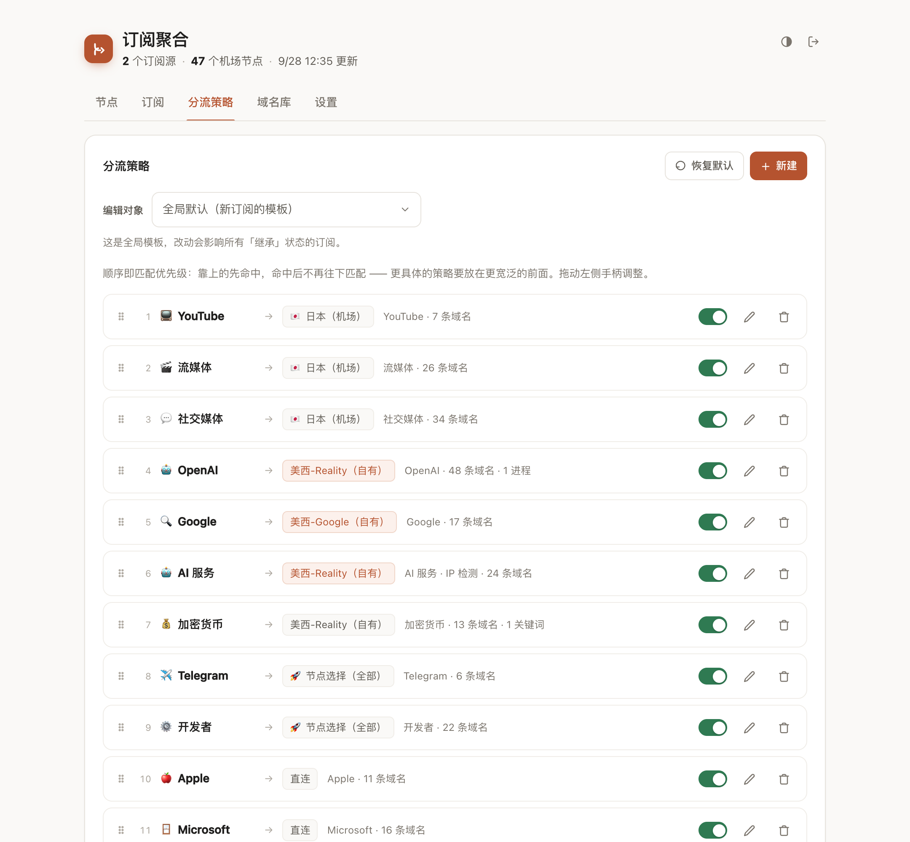
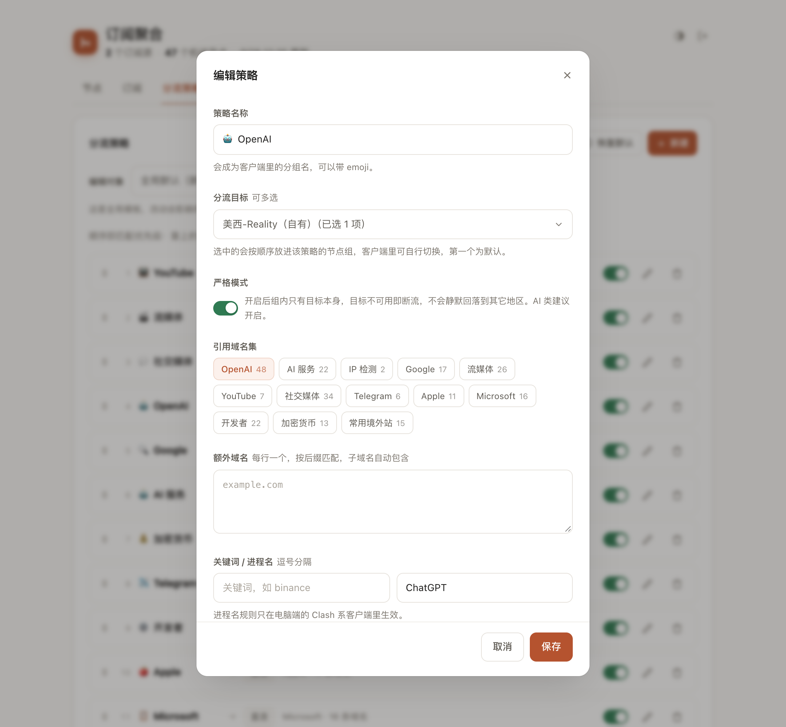
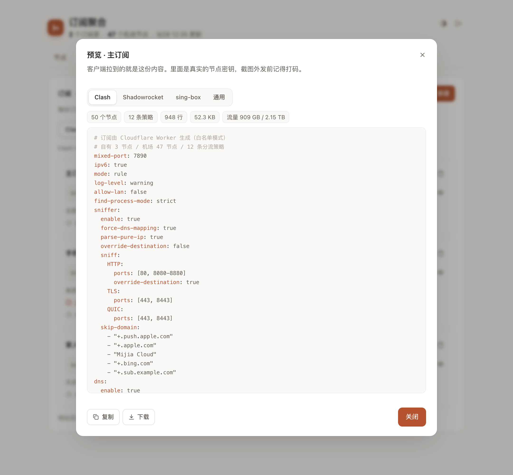
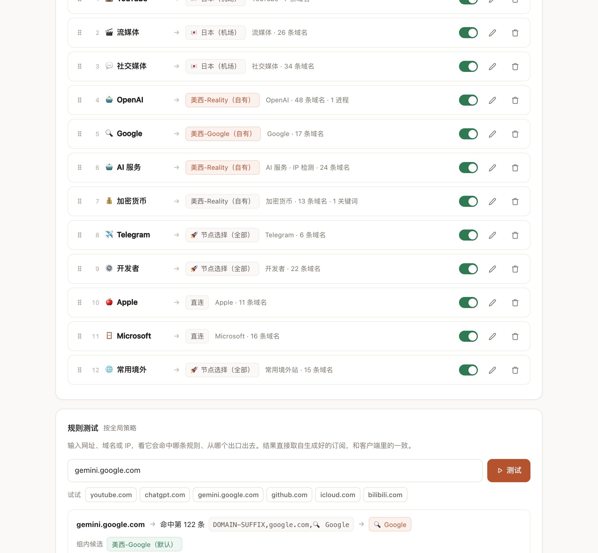
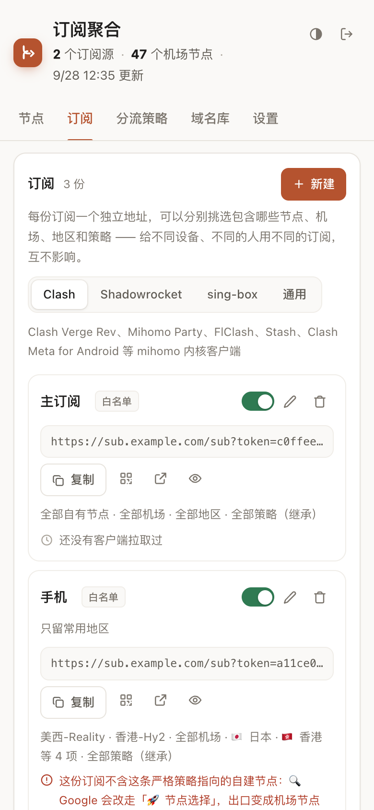
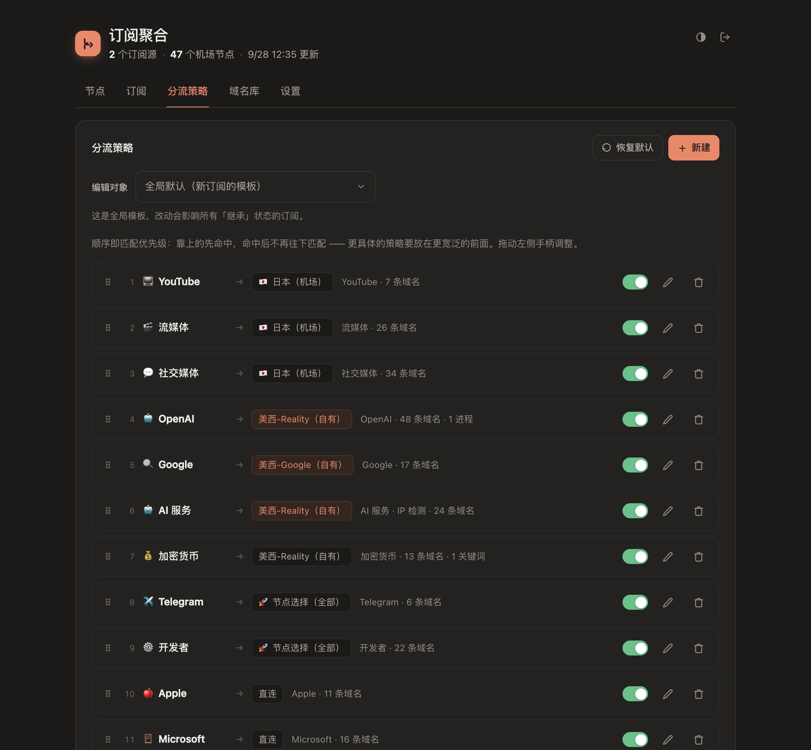

# cf-sub-worker

把自建节点和多家机场订阅聚合成一份，按可视化配置的规则分流下发。整站跑在 Cloudflare Workers 上，配置存 Workers KV，**没有服务器，没有数据库，单文件部署**。

一个 token 一份配置：给手机、电脑、家人各发一份订阅，各自包含哪些节点、走什么分流规则，互不影响。

```
自建节点 ─┐
机场 A  ─┼─→  Cloudflare Worker  ─→  Clash / Shadowrocket / sing-box / v2rayN
机场 B  ─┘         ↕
              Workers KV
```

## 它解决什么

同时用自建节点和机场订阅时，通常要在客户端里手工合并、手工改分流规则，换个设备再来一遍。这个项目把这些收敛到一处：

- **节点聚合** — 多家机场订阅 + 自建节点合成一份，节点按地区重命名成 `🇯🇵 日本 01` 这种统一格式，不再是机场原本的 `2x专线-日本-1|勿跑大流量`
- **分流可配** — AI、流媒体、社交、Apple、Google 等 12 条策略开箱可用，域名库 13 组可增删改，拖拽调整优先级
- **多订阅** — 每份订阅独立 token，可分别挑选包含哪些节点/地区/策略，甚至给每份订阅配一套完全不同的分流规则
- **格式通吃** — 进来认 Clash YAML（单行 flow 与块式缩进）、base64 与明文分享链接列表；出去按客户端下发 Clash YAML / Shadowrocket conf / sing-box JSON / base64 节点列表
- **导入省事** — 订阅页按客户端给出地址，一键复制、扫码、或直接唤起客户端导入；导入前可以预览客户端将拿到的完整配置
- **规则可验证** — 输入一个网址，立刻看到它命中哪条规则、从哪个出口出去，结果直接取自生成好的订阅
- **拉不动也能用** — 机场挡住 Worker 出站时，可以把订阅内容从浏览器复制粘贴进来，走同一套解析并存成快照
- **可观测** — 机场剩余流量、到期倒数显示在管理端，也如实下发给客户端；每份订阅最近被哪些客户端拉过一目了然，token 外泄能及时发现
- **可备份** — 全部配置一键导出成文件，换账号、误操作都能原样恢复

## 截图

> 截自 [`docs/demo.html`](docs/demo.html) —— 整份 `worker.js` 放在页面里跑的演示页，数据是示例。下载后用浏览器直接打开就能试玩全部功能（增删改、预览、规则测试都是真的），不用部署。

| | |
|---|---|
|  |  |
| 节点：机场用量与到期、自建节点、链式代理、可搜索的节点列表 | 订阅：按客户端给地址，复制 / 二维码 / 一键导入 / 预览 |
|  |  |
| 分流策略：拖拽即调整优先级，可按订阅单独配置 | 策略编辑：分流目标多选、严格模式、引用域名集 |
|  |  |
| 配置预览：四种格式切换，内容与客户端拿到的一致 | 规则测试：看一个网址命中哪条规则、走哪个出口 |
|  |  |
| 手机上同样好用，弹窗改为底部抽屉 | 暗色主题，跟随系统或手动切换 |

## 部署

需要一个 Cloudflare 账号，API token 授予 **Workers Scripts: Edit** 和 **Workers KV Storage: Edit** 两项权限。

```bash
git clone https://github.com/<you>/cf-sub-worker.git
cd cf-sub-worker

export CF_API_TOKEN=...      # My Profile → API Tokens
export CF_ACCOUNT_ID=...     # 控制台右侧栏
bash deploy.sh
```

脚本会自动创建 KV namespace、注入绑定、部署，并打印一个**初始化令牌**。到 Cloudflare 控制台给 Worker 绑一个域名，打开 `https://你的域名/admin`，用该令牌验证身份并设置管理密码。

再次部署（更新代码）时，脚本沿用 Worker 现有的 KV 绑定与全部 secret / 变量，部署前会先跑测试，部署后逐个核对绑定一个不少。几个常用开关：

```bash
DRY_RUN=1 bash deploy.sh              # 只核对：打印将要提交的绑定，不真的部署
SKIP_TESTS=1 bash deploy.sh           # 跳过部署前的测试
KV_NAMESPACE_ID=... bash deploy.sh    # 明确指定 KV namespace
```

读取 Worker 现有设置失败（网络抖动、限流）时脚本会直接中止 —— 绝不把线上绑定当成空的覆盖掉。

之后管理端的「节点」页会给出上手清单，依次完成：

1. **设置 → 站点** — 填本站域名（用于 DNS 策略与自身直连规则）
2. **节点** — 添加机场订阅源；有自建节点就一并添加（支持 VLESS Reality、VLESS WebSocket+TLS 与 Hysteria2，可粘贴分享链接自动填表）
3. **订阅** — 默认已有一份，选好客户端后复制地址、扫码或一键导入；给不同设备可再建几份

## 客户端

在「订阅」页顶部选客户端，下面每份订阅的地址、二维码、一键导入都会跟着切换。

| 客户端 | 选哪个 | 说明 |
|--------|--------|------|
| Clash Verge Rev / Mihomo Party / FlClash / Stash / Clash Meta for Android | Clash | 下发 mihomo 内核的 Clash YAML |
| Shadowrocket | Shadowrocket | 地址带 `&fmt=shadowrocket`，下发原生 `.conf`；iPhone 用相机扫「一键导入」二维码可直接唤起 |
| sing-box 官方客户端（SFI / SFA / SFM） | sing-box | 地址带 `&fmt=singbox`，需要 sing-box **1.12 及以上** |
| v2rayN / v2rayNG / Hiddify 等 | 通用 | 地址带 `&fmt=share`，base64 节点列表，**不含分流规则**，也不含链式代理 |

不加参数时按 User-Agent 猜格式（认不出就给 Clash YAML）。其它参数：`&mode=blacklist` 切黑名单模式（没命中规则的直连），`&upstream=0` 应急只下发自有节点。

订阅响应带 `Subscription-Userinfo` 头：这份订阅所含机场的流量相加、到期取最早的一家，客户端里能直接看到剩余流量和到期日。一家都拿不到用量时不发这个头，不编数字。

## 分流策略

策略是有序的，**命中即停止匹配**，所以更具体的要排在更宽泛的前面 —— 比如 `📺 YouTube` 必须在含 `googleapis.com` 的 AI 策略之前，否则 `youtubei.googleapis.com` 会被 AI 规则抢走。默认顺序已排好，拖拽时留意；拿不准的时候，用页面下方的「规则测试」输一个网址看看。

每条策略可配：

- **分流目标** — 自有节点 / 链式代理 / 机场地区组 / 全部节点 / 直连 / 拒绝，**可多选**：选多个时都放进策略组，第一个是默认项
- **严格模式** — 组内只放目标本身，目标不可用即断流。AI 类建议开启：静默回落会让出口悄悄变成机房 IP，比断流更难察觉
- **引用域名集** — 从 13 组内置域名库里选，也可新建；改一处，所有引用它的策略同步生效
- **额外域名 / 关键词 / 进程名** — 策略私有的补充规则

每份订阅的策略可以是「继承全局」或「专属」。专属模式下持有一份完整副本，目标、域名、顺序都与全局无关 —— 典型用法是全局 AI 走美西住宅出口，手机订阅的同名策略改指日本节点。

某份订阅不含严格策略指向的自建节点时（比如给家人的订阅不带自建节点），那组会回落到「🚀 节点选择」，出口变成机场节点 —— 订阅卡片上会点名提示是哪几条。

## 机场元信息

流量与到期优先读 `Subscription-Userinfo` 响应头，缺失时从节点名里的公告文本兜底解析。已覆盖的写法：

- 日期 `2026-08-10` / `2026/08/10` / `2026年8月10日`
- 流量 `剩余流量：809.16 GB` / `剩余: 100GB` / `Remaining: 50 GB` / `已用 390.8GB` / `390.8GB/1200GB`
- 天数 `距离下次重置剩余：7 天`（不会误判为到期）/ `剩余 30 天`
- 单位 GB/TB/MB、简写 G/T、GiB 均按二进制换算；时间戳秒与毫秒自动归一

解析不到就留空，不猜。公告识别做了精确匹配，`香港原生IP-1|勿跑大流量` 这类含「流量」二字的正常节点名不会被误吞。点订阅源行上的用量，能看到逐个客户端身份的试拉详情。

## 安全

管理端开在公网上，订阅 token 就是全部节点凭据，所以：

- **管理密码** PBKDF2 加盐存储（老版本的无盐哈希在下次登录时自动升级）；同一 IP（IPv6 按 /64）连续输错 5 次锁定 15 分钟，改密码时猜旧密码同样计数。计数放在内存与 Cache API 里、不写 KV —— 否则谁都能不登录就刷光每天的 KV 写入额度
- **会话** cookie 为 `HttpOnly` / `Secure` / `SameSite=Lax`，写接口另外核对来源并只收 JSON，跨站伪造不了；改密码或「让其它设备下线」会让其它会话全部失效
- **管理端页面**带 CSP、禁止被嵌套、不发 Referer；机场送来的节点名、机场名在管理端一律转义 —— 它们是第三方可控的输入
- **订阅 token** 至少 16 位，定长比较；订阅页记录每份订阅最近被哪些客户端拉过（IP、客户端、时间），出现不认识的就重新生成 token
- **备份文件**包含全部配置和节点凭据（不含登录密码），请妥善保管

## 数据

全部存 Workers KV（绑定名 `CONF`）。**代码里不含任何站点信息**，clone 下来就是干净的。

| key | 内容 |
|-----|------|
| `settings` | 本站域名、额外直连域名与 IP、强制代理域名、DNS |
| `nodes` | 自有节点 |
| `upstreams` | 机场订阅源 |
| `overrides` | 节点级重命名 / 停用 |
| `profiles` | 订阅档案，一个 token 一份；`policies` 为 `'inherit'` 或专属策略数组 |
| `policies` | 全局分流策略，数组顺序即优先级 |
| `lib` | 自定义 / 改过的域名集，与内置 `PRESETS` 合并 |
| `chains` | 链式代理 |
| `cache:nodes` | 机场拉取缓存，1 小时新鲜期，7 天兜底 |
| `snap:<源 id>` | 每个订阅源最后一次成功拉取的快照 |
| `hits:<订阅 id>` | 最近拉取这份订阅的客户端（每客户端半小时记一次，每天最多写 60 次） |
| `auth:password` / `auth:secret` | 管理端凭据 |

各 `DEFAULT_*` 常量只是首次初始化的种子，KV 有值就以 KV 为准。「设置 → 备份与恢复」导出的就是上表前八项加快照。

## 开发

```bash
node dev/server.mjs                     # 本地预览 http://localhost:8787/admin，密码 devpassword
cd test && npm install && node run.cjs  # 单元与接口测试
node test/e2e.mjs                       # 端到端：在无头 Chrome 里把管理端完整点一遍（需本机有 Chrome）
node scripts/build-demo.mjs             # 重新生成 docs/demo.html
node scripts/shots.mjs                  # 重新生成 README 截图
bash deploy.sh                          # 部署
```

`worker.js` 单文件承载全部逻辑 —— Workers 部署一个 JS 文件最省事，也免去打包步骤。改完先跑测试再部署。

本地预览在 Node 里直接执行 `worker.js`，不需要 wrangler：KV 落盘到 `dev/.kv.json`（删掉即回到示例数据），自带两个示例机场和一个模拟被拦截的机场，改完 `worker.js` 刷新页面即生效。

管理端前端整个嵌在 `adminHTML()` 的模板字符串里：前端代码里的反斜杠、反引号、`${` 都要转义（`\\n`、`` \` ``、`\${`），写成单个反斜杠会被模板提前吃掉 —— `run.cjs` 会实际编译前端脚本和其中的正则来把关。

测试覆盖三种输出格式的合法性与引用完整性、三种入站格式的等价性、规则优先级、目标解析回退、机场元信息多格式解析、多订阅裁剪、粘贴导入、认证与会话、备份恢复、规则测试，以及一组管理端 UI 的静态断言；端到端测试把每个页面、每种弹窗和主要的增删改真的点一遍，页面里出现任何未捕获的异常都算失败。

## 踩过的坑

**规则顺序敏感。** 命中即停，具体的必须在宽泛的前面。测试里有对应断言。

**TUN 模式必须开 sniffer。** 客户端若用自带 DoH（Chrome Secure DNS 等）绕过 `dns-hijack`，Clash 在 TUN 层只看得到 IP，所有 `DOMAIN-SUFFIX` 规则会**静默失效**、全部落到兜底。开启后从 TLS SNI 还原域名。

**DNS 防泄漏靠 `respect-rules`。** 少了它，代理域名的 DNS 查询会在本地明文发出。同时 `proxy-server-nameserver` 必须直连，否则与它循环依赖。

**IPv6 分享链接要包方括号。** `hysteria2://pwd@[2001:db8::1]:5021`，漏了客户端整条导入失败。

**机场会拦 Cloudflare Workers 的出站请求。** 自己浏览器打开好好的订阅链接，Worker 去拉就是 403 —— 尤其在机场也用 Cloudflare 时（Orange-to-Orange）：出口是 CF 的 ASN，请求还被平台强制加上 `CF-Worker` 头，机场侧一条 WAF 规则就能全挡掉，这个头代码里删不掉。所以换几种客户端 UA 重试只能救一部分，真正的兜底是从浏览器复制订阅内容粘贴进来。

**转不出 outbound 的节点必须连分组引用一起剔除。** sing-box 遇到不存在的 outbound 是拒绝加载整份配置，不是跳过那几个。`toSB` 认不出的协议若只 `filter(Boolean)` 掉，地区组却仍按全量节点取名字，整份订阅就废了 —— 少几个节点还能用，配置非法一点都不能用。

**免费版 Workers 单次请求只有 10ms CPU。** 完整 Clash 配置里 `rules` 能占九成行数，既没节点也没公告，扫它就是白烧预算。解析扫到 `rules:` 就停。密码哈希的迭代次数也受它约束：PBKDF2 一万次约 2.5ms，改密码要算两次也还有余量。

**免费版 KV 每天只有 1000 次写入。** 订阅每被拉一次就写一笔记录的话，一个外泄的 token 被人狂刷，配额很快耗光，连管理端保存配置都跟着失败。所以拉取记录每个客户端半小时只记一次、每份订阅每天封顶 60 次；这个上限是「读出来再加一」，并发请求会一起读到同一个数，所以同一份订阅的记录还要在 isolate 里排队写。登录失败计数更是干脆不写 KV —— 那是不用登录就能触发的写入。

**一个坏节点能让整份订阅加载不了。** Reality 公钥不是 43 位 base64url、short-id 不是偶数位十六进制，mihomo 就拒绝整份配置，不是跳过那一个。所以解析时就把这类节点剔掉（旧缓存和一次性链接的快照在取用时再过一遍），手输的自有节点在保存时就拦下。

**内联事件里的字符串，只做 HTML 转义不够。** `onclick="f('${esc(name)}')"` 里，浏览器先把属性值里的 `&#39;` 还原成单引号，再当 JS 执行 —— 一个名字里带 `');…;('` 的机场节点，管理员点一下停用开关，就能把全部订阅 token 发到外面去。要进 JS 字符串的值先 `JSON.stringify` 再做 HTML 转义（前端的 `jsq()`），或者干脆只传 `this`、从 `data-*` 里取值。CSP 在这里帮不上：页面是单文件内联脚本，只能留着 `'unsafe-inline'`。

**函数里同名的局部常量会遮蔽外面的函数。** 函数体后面才 `const x = …`，前面调用同名的外层 `x()` 就会触发暂时性死区，整个页面白屏 —— 语法检查照样全绿。这类错误只有真跑起来才发现，所以有了 `test/e2e.mjs`。

**管理端读节点缓存，会撞上刚被作废的缓存。** 切 tab 的接口只读缓存（不该为了一份地区清单去等机场），而增删订阅源会清空缓存 —— 那一刻所有地区都像「不存在」，策略页满屏误报。地区清单以真正拉取过的 `/api/state` 为准，在前端合并。

**编辑器只列「当前有效」的选项，会悄悄丢数据。** 订阅勾了一个暂时没有节点的地区、或一条停用中的策略，编辑器里没有这个选项，随手保存一次勾选就没了。现在都会列出来，并标明「当前无节点」「已停用」。

**弹窗退场动画不能复用入场的 animation-name。** 同名时浏览器不重启动画，`animationend` 永不触发，遮罩会一直留着把页面点击全吞掉。

**弹窗不能靠点遮罩关。** 在输入框里拖选文字、拖 textarea 的缩放手柄，只要在弹窗外松手，浏览器就把 click 派给按下点与松开点的公共祖先 —— 恰好是遮罩，一松手弹窗就没了、填的全丢。中文输入法按 Esc 撤候选词也会连带关窗，而 Safari 先发 `compositionend` 再发 `keydown`，光看 `isComposing` 拦不住。现在关窗只走右上角 × 和「取消」，改过的表单按 Esc 也不关。

**多行对齐要用 subgrid。** 每行各自 `display:grid` 时列宽只在行内计算，行与行不共享，内容一变就错位。窄屏上多列放不下，改成 flex 换行，用一个 `::after` 充当强制换行把「名称与操作」「地址」「用量」分成三层。

**部署后有数秒边缘传播延迟。** 验证前先等 30 秒，否则会打到旧版本。另外 PUT scripts 接口若 metadata 不带 `bindings` 会**清空**现有绑定，每次部署都要重新声明；以 `inherit` 声明的绑定若继承不到，默认是**静默丢掉** —— `deploy.sh` 带上 `bindings_inherit=strict` 让它报错，并在部署后逐个核对。

## License

MIT
